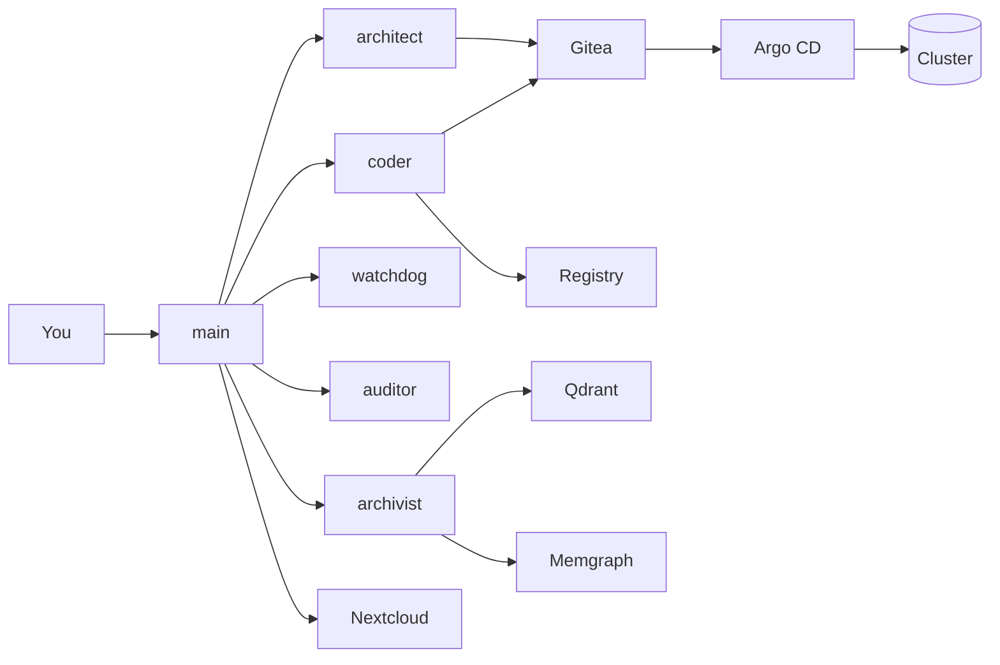

# ai-homebase

> Self-hosted AI homelab with standing agents, shared memory, internal repos, sandbox runtimes, and a reviewed GitOps mutation path back into the cluster.

`ai-homebase` bootstraps a personal AI backend that is meant to feel less like a demo chat box and more like a weird, useful machine in your homelab. The stack starts with a standing OpenClaw team: `main` talks to you, `architect` plans, `coder` implements, `archivist` curates durable memory, and `watchdog` plus `auditor` monitor and review the system.

Around that agent runtime, the bootstrap path also brings up Nextcloud for shared project state, Qdrant and Memgraph for recall, Gitea plus the internal registry for source and artifacts, and Argo CD for the reviewed path from repo state back into the running cluster. The fun part is that the system is wired to work on itself through the same repos, images, and GitOps flow it uses for everything else.

## 🚀 Why Read On

- a standing multi-agent control room instead of a single stateless assistant
- durable documentation, memory, and shared project surfaces
- internal repos and image pipelines the agents can work through
- a practical loop for preparing cluster changes through code, images, and GitOps

## 🗺️ Mutation Loop



The intended loop is:

1. You give a requirement to `main`.
2. `architect` shapes the plan when the work needs design or decomposition.
3. `coder` turns accepted work into repo, image, and GitOps changes.
4. Gitea and the registry hold the durable artifacts.
5. You review and trigger the GitOps deployment step through Argo CD.
6. `watchdog`, `auditor`, and `archivist` feed health, review, and memory back into the next iteration.

Agents can prepare meaningful change, but the operator remains the final deployment gate.

## 🎯 Targets

| Target | Use it for |
| --- | --- |
| `k3d` | local full-stack validation and smoke testing |
| `k3s` | long-running single-node homelab deployment |

## ⚡ Quick Start

### `k3d`

```bash
cp bootstrap.example.toml bootstrap.local.toml
./scripts/bootstrap-stack.sh --profile k3d --cluster-name ai-homebase-dev --bootstrap-config bootstrap.local.toml
```

### `k3s`

```bash
sudo ./scripts/install-k3s-ubuntu-2404.sh
cp bootstrap.example.toml bootstrap.local.toml
./scripts/bootstrap-stack.sh --profile k3s --bootstrap-config bootstrap.local.toml
```

Fill `bootstrap.local.toml` with hostnames, mail settings, provider keys, admin credentials, and any first-run Gitea overrides before either path. The shipped OpenClaw defaults now assume `OPENAI_API_KEY`, `ANTHROPIC_API_KEY`, and `GEMINI_API_KEY` are all present unless you override the default agent model routing. Gitea Actions are enabled by default, so the standard bootstrap path also prepares the dedicated runner VM unless you explicitly set `services.gitea.actions.enabled=false`.
If you install `k3s` with a non-default `--openclaw-shared-state-dir`, pass that same path to `bootstrap-stack.sh --shared-openclaw-state-source ...` so the gateway, sandbox VM, and CA export stay aligned.

## 📚 Docs Start Here

Use this README as the front door, then jump into the full docs index at [docs/README.md](./docs/README.md).

If you are orienting yourself:

- Platform architecture: [docs/architecture.md](./docs/architecture.md)
- Deployment overview: [docs/deployment.md](./docs/deployment.md)
- Configuration and values layering: [docs/configuration.md](./docs/configuration.md)
- Service defaults and secret contracts: [docs/services.md](./docs/services.md)

If you are trying to do work:

- Local `k3d` workflow: [docs/deployment-k3d.md](./docs/deployment-k3d.md)
- Homelab `k3s` runbook: [docs/runbook-homelab.md](./docs/runbook-homelab.md)
- GitOps operating model: [docs/gitops.md](./docs/gitops.md)
- Commands and validation: [docs/commands.md](./docs/commands.md)

If you are working on agents and runtime behavior:

- OpenClaw runtime contract: [docs/openclaw-runtime.md](./docs/openclaw-runtime.md)
- Agent process examples: [docs/agent_process_examples/README.md](./docs/agent_process_examples/README.md)
