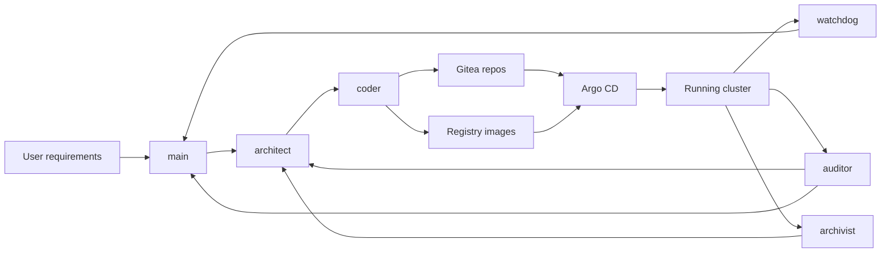

# ai-homebase

`ai-homebase` is a practical homelab platform for building a personal AI control plane that can iteratively redesign, re-code, and re-deploy itself.

This repo is not just “some Helm charts” and it is not just “an OpenClaw install.” It is a controlled self-improvement system: a multi-agent stack with durable documentation, memory, source control, image publishing, and GitOps delivery wired together so the cluster can take a requirement and push it all the way toward running software. 🚀

The core loop is:

- you describe what you want
- `architect` turns it into an execution-ready plan
- `coder` implements it, updates repos, and publishes runtime images
- Gitea and the in-cluster registry become the durable artifact layer
- Argo CD applies reviewed cluster changes
- `watchdog`, `auditor`, and `archivist` feed observations, quality checks, and durable knowledge back into the next iteration

In other words: this cluster can become almost anything you want, limited mainly by hardware, budget, and the consistency of the documentation, memory, and graph it maintains about itself.

## Why This Exists

Most “AI homelab” setups stop at chat, tools, or a single coding agent. `ai-homebase` goes further:

- 🧠 a standing multi-agent OpenClaw topology with clear role separation
- 🗂️ Nextcloud as durable shared project documentation and operator-facing memory
- 🕸️ Qdrant plus Memgraph for semantic and structural long-term knowledge
- 🧪 remote Docker sandboxes so specialist agents can safely execute real work
- 🧱 Gitea plus an in-cluster registry for code and runtime artifacts
- 🔁 Argo CD as the reviewed path from repo state to cluster state

The result is an AI system that can propose, implement, document, and operationalize change instead of just talking about it.

## Controlled Self-Mutation

The mutation path is deliberate, not magical:



Today’s hard control boundary is still intentional:

- agents can plan, implement, document, review, monitor, and prepare mutations
- the user still reviews the diff and manually syncs Argo CD for cluster-state changes

That is the current safety model: bold automation inside the loop, explicit operator approval at the deployment gate.

## What You Get

- OpenClaw bootstrapped as `main`, `architect`, `coder`, `archivist`, `watchdog`, and `auditor`
- repo-managed specialist workspaces and seeded cluster-self-documentation in Nextcloud
- a coder flow that goes from specification to code to Gitea to GitOps to cluster
- an in-cluster sandbox-images repo and registry for evolving the agent runtime itself
- repo-managed per-agent continuity files plus seeded daily wrap-up cron jobs for the standing desk agents
- a weekly auditor loop that can identify quality issues, cost leaks, workflow bottlenecks, and candidates to replace repeated LLM work with deterministic Kubernetes services or CronJobs
- one bootstrap input model for both fast local iteration in `k3d` and long-running deployment in `k3s`

The intended long-running target today is a single-node `k3s` install on a Hetzner A42U-class machine with a Ryzen 7 Pro 8700GE, 64 GB RAM, and roughly 3 TB of storage. That posture assumes headroom for the current stack plus heavier services such as Qdrant, Memgraph, and future coder-deployed applications.

## Start Here

- Target chooser: [docs/deployment.md](./docs/deployment.md)
- Full docs index: [docs/README.md](./docs/README.md)
- Configuration and bootstrap model: [docs/configuration.md](./docs/configuration.md)
- Service contracts: [docs/services.md](./docs/services.md)
- Secret workflow: [docs/secrets.md](./docs/secrets.md)

## Quick Start

### Local `k3d`

```bash
cp bootstrap.example.toml bootstrap.local.toml
./scripts/k3d-local-bootstrap.sh --cluster-name ai-homebase-dev --bootstrap-config bootstrap.local.toml
```

Use [docs/deployment-k3d.md](./docs/deployment-k3d.md) for the full local workflow, including the required NixOS host preparation and the integrated GitOps handoff that now completes before the bootstrap returns.

### Homelab `k3s`

```bash
sudo ./scripts/install-k3s-ubuntu-2404.sh
cp bootstrap.example.toml bootstrap.local.toml
./scripts/bootstrap-stack.sh --profile k3s --bootstrap-config bootstrap.local.toml
```

Use [docs/runbook-homelab.md](./docs/runbook-homelab.md) for the full Ubuntu host-prep and integrated bootstrap path.

In both cases, fill in the `[mail]` section and the per-agent model sections in `bootstrap.local.toml` before bootstrapping so Nextcloud/Vaultwarden mail and the bootstrapped OpenClaw `main`, `architect`, `coder`, `archivist`, `watchdog`, and `auditor` agents are configured correctly. Each agent supports `model` plus optional `fallback_models` in the bootstrap config, and `coder` also supports `codex_model` for the provider-qualified Codex CLI model used inside its sandbox, defaulting to `openai/gpt-5.4-mini` with `openai/gpt-5.3-codex` available as a higher-cost override.

The sandbox init writes a modern `~/.codex/config.toml` with top-level `model = "<bare-model>"`, forces API-key login mode, and seeds `~/.codex/auth.json` with `codex login --with-api-key` from `OPENAI_API_KEY`, so the default CLI model stays Helm-configurable without rebuilding the image and the built-in OpenAI provider can use its normal websocket path. The canonical first-run secret flow is `scripts/bootstrap-secrets.sh`, and operators can later manage long-lived encrypted manifests through the workflow documented in [docs/secrets.md](./docs/secrets.md). The default coder posture assumes a Claude-based orchestrator delegating substantial coding to Codex, so the standard bootstrap expects both `ANTHROPIC_API_KEY` and `OPENAI_API_KEY` through the `openclaw-secrets` Secret.

The same bootstrap flow also creates a dedicated `openclaw` Nextcloud user, seeds the standard Nextcloud MCP server definition, pre-seeds specialist workspace files for the multi-agent topology, and seeds the initial Memgraph knowledge graph baseline for the cluster. Archivist keeps one canonical `mgconsole` command surface in both runtimes: the gateway gets the in-cluster Memgraph Service as `MEMGRAPH_HOST`, while the Docker sandbox gets the routed external Memgraph hostname under that same variable.

## Documentation Map

- Target guides: [docs/deployment-k3d.md](./docs/deployment-k3d.md), [docs/runbook-homelab.md](./docs/runbook-homelab.md)
- Deep dives: [docs/architecture.md](./docs/architecture.md), [docs/security.md](./docs/security.md), [docs/networking.md](./docs/networking.md), [docs/gitops.md](./docs/gitops.md)
- Operational reference: [docs/commands.md](./docs/commands.md), [docs/services.md](./docs/services.md), [docs/storage.md](./docs/storage.md)
- Troubleshooting: [docs/k3d-troubleshooting.md](./docs/k3d-troubleshooting.md)
