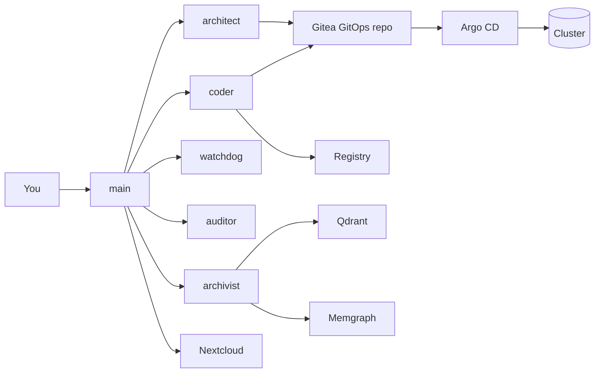

# ai-homebase

> Self-hosted AI homelab with agents, memory, repos, sandboxes, and a real mutation path back into the cluster.

`ai-homebase` is a practical homelab setup for building a personal AI system that can iteratively redesign, re-code, and re-deploy itself.

At the center is a standing OpenClaw agent setup: `main` talks to you, `architect` plans, `coder` writes code and handles repo work, `archivist` curates memory, and `watchdog` and `auditor` keep an eye on the system.

The interesting part is that this is wired into the homelab itself. The coding agent owns the in-cluster Gitea repos, including the GitOps repo that describes the cluster. So a requirement can turn into a plan, then code, then commits, then images, then GitOps state, then an updated cluster.

Around OpenClaw, this repo bootstraps Nextcloud for shared docs and project state, Qdrant and Memgraph for memory, Gitea plus a local registry for artifacts, and Argo CD as the reviewed path from repo state back into the running cluster.

## 🚀 Why This Exists

- 🔁 controlled self-mutation through a coder-owned Gitea GitOps repo
- 🤖 a standing agent setup instead of a single stateless chat box
- 🧠 durable memory and documentation instead of disposable chat history
- 🛠️ one homelab where agents, code, images, and cluster state all connect

## 🧱 The Stack

| Layer | Service | Role |
| --- | --- | --- |
| Agent runtime | `OpenClaw` | Multi-agent execution, delegation, tools, sandboxes |
| Shared memory | `Nextcloud` | Project docs, coordination state, long-lived human-readable context |
| Semantic recall | `Qdrant` | Vector memory for retrieval and MCP-backed memory workflows |
| Structural recall | `Memgraph` | Graph memory for entities, relationships, and curated knowledge |
| Source of truth | `Gitea` | Coder-owned repos for GitOps, code, and runtime source |
| Artifact storage | `Registry` | Image distribution for sandboxes and future services |
| Deployment handoff | `Argo CD` | Reviewed path from repo state back into the running cluster |

The whole thing is meant to feel less like a demo app and more like a weird but useful box in your homelab.

## 🗺️ System Model



The intended loop looks like this:

1. You describe a requirement to `main`.
2. `architect` turns it into an execution-ready plan.
3. `coder` implements code, repos, images, and GitOps changes.
4. Gitea and the registry hold durable artifacts.
5. Argo CD applies reviewed cluster changes.
6. `watchdog`, `auditor`, and `archivist` feed health, quality, and memory back into the next cycle.

So yes, this is an attempt at a real personal AI backend: memory, tools, repos, images, runbooks, and a bias toward reproducible infrastructure over prompt theater.

The fun bit is that the system that lives in the cluster is also wired to change the cluster: `coder` works through Gitea, the GitOps repo becomes the durable mutation path, and Argo CD is the bridge back into running state.

The safety boundary is explicit: agents can prepare changes, inspect the system, and do meaningful work, but the operator remains the final deployment gate after bootstrap.

## 🧰 Bootstrap Posture

This repository is the first-run bootstrap layer. It is meant to take a fresh cluster from zero to a working system, then get out of the way so GitOps and the live services can own durable state. If a bootstrap path stops being canonical, it should be removed rather than kept around as legacy ballast.

## 🎯 Targets

| Target | Use it for | Notes |
| --- | --- | --- |
| `k3d` | Full local validation and smoke tests | Fastest way to experience the whole stack on a workstation |
| `k3s` | Long-running single-node homelab deployment | Sized for a serious self-hosted box with room to grow |

The current productive target is a Hetzner A42U-class host with a Ryzen 7 Pro 8700GE, 64 GB RAM, and roughly 3 TB storage. The `k3s` overlay is sized for the current stack, the Incus-backed OpenClaw sandbox VM, and additional future services.

Both targets standardize on `ingress-nginx` with the `nginx` ingress class. The `k3s` prep script disables the bundled k3s Traefik add-on on fresh installs.

## ⚡ Quick Start

### 🧪 Local `k3d`

```bash
cp bootstrap.example.toml bootstrap.local.toml
./scripts/k3d-local-bootstrap.sh --cluster-name ai-homebase-dev --bootstrap-config bootstrap.local.toml
```

Use [docs/deployment-k3d.md](./docs/deployment-k3d.md) for the full local workflow, teardown, and OpenClaw device approval steps.

### 🏠 Homelab `k3s`

The Hetzner host is expected to already have working Docker Engine and git for image builds, image publishing, and GitOps pushes. The repo prep script intentionally does not install or own those host tools.

```bash
sudo ./scripts/install-k3s-ubuntu-2404.sh
cp bootstrap.example.toml bootstrap.local.toml
./scripts/k3s-homelab-sandbox-up.sh --bootstrap-config bootstrap.local.toml
./scripts/bootstrap-stack.sh --profile k3s --bootstrap-config bootstrap.local.toml
```

Use [docs/runbook-homelab.md](./docs/runbook-homelab.md) before running this on the server.

## 🔐 Bootstrap Inputs

Fill `bootstrap.local.toml` before either target bootstrap:

- service hostnames
- `[mail]` sender domain and SMTP hostname
- provider API keys for the selected OpenClaw agent models
- shared admin identity and first-run passwords/tokens
- optional GitOps and coder Gitea identity overrides

The same config drives both `k3d` and `k3s`. Target-specific behavior belongs in `charts/platform-stack/values-k3d.yaml`, `charts/platform-stack/values-k3s.yaml`, or a committed/operator overlay, not ad-hoc long-lived `--set` flags.

## 📚 Documentation

- Target chooser: [docs/deployment.md](./docs/deployment.md)
- Local workflow: [docs/deployment-k3d.md](./docs/deployment-k3d.md)
- Homelab runbook: [docs/runbook-homelab.md](./docs/runbook-homelab.md)
- Configuration model: [docs/configuration.md](./docs/configuration.md)
- OpenClaw runtime contract: [docs/openclaw-runtime.md](./docs/openclaw-runtime.md)
- Service contracts: [docs/services.md](./docs/services.md)
- Commands and validation: [docs/commands.md](./docs/commands.md)
