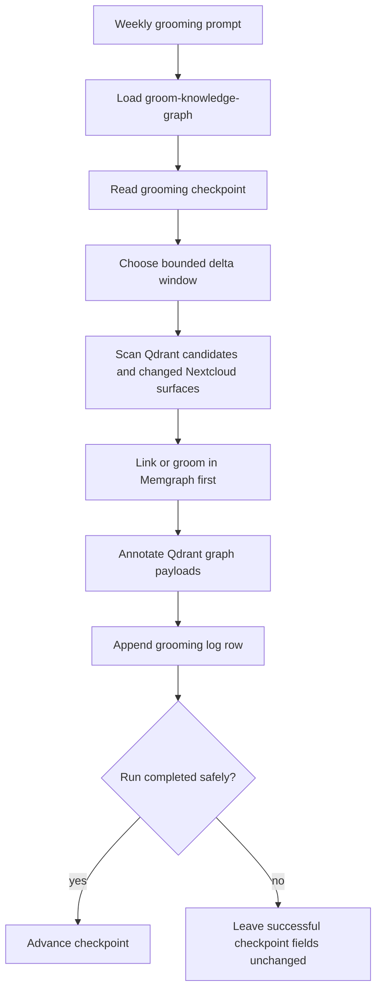

# Archivist Weekly Grooming

## Trigger

- Source: weekly cron prompt
- Session type: archivist standing main session with a scheduled system-event prompt

## Guaranteed Starting Context

- archivist system prompt files
- available archivist workspace skills and local query/qdrant helper files
- current session is not a heartbeat and is not an isolated cron context

## Context That Must Be Fetched Explicitly

- `state/grooming-checkpoint.json`
- `groom-knowledge-graph` skill
- any changed Nextcloud surfaces discovered from the checkpoint window and registries
- Qdrant candidates and Memgraph query results produced during the run

## Flow

## Step Notes

1. Archivist must use the real skill name `groom-knowledge-graph`.
2. The checkpoint is runtime state and must be read before any delta decision is made.
3. The grooming pass stays bounded unless a request explicitly asks for historical backfill.
4. Memgraph updates happen before Qdrant graph-link annotations.

## Escalation And Output

- durable outputs: Nextcloud grooming log, Memgraph links, Qdrant graph payloads, checkpoint update
- if the run cannot complete safely, record the issue and do not advance successful checkpoint timestamps

## Prompt-Writing Pitfalls

- do not reference nonexistent skill names
- do not imply that Nextcloud docs are the primary truth source for archivist
- do not tell archivist to run an unbounded historical pass by default
