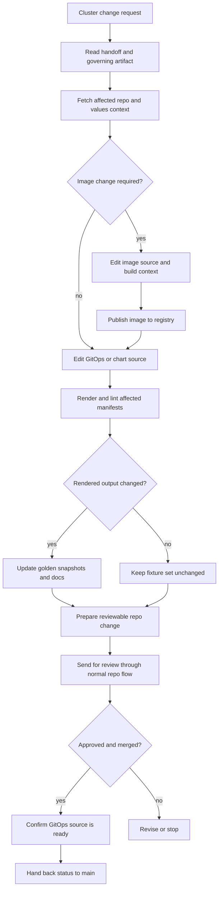

# Coder Cluster Change

## Trigger

- Source: `main` or `architect` hands `coder` a task that changes cluster-managed state
- Session type: coder standing main session or a coder sandbox task started from that session

## Guaranteed Starting Context

- coder system prompt and workspace files
- available coding, git, registry, and repo-management tools in the normal coder environment
- the handoff packet itself, if `main` or `architect` provided one

## Context That Must Be Fetched Explicitly

- governing artifact from `architect` when the task is spec-first
- relevant repo state in the GitOps repo and, when needed, the sandbox-images repo
- affected chart values, templates, seed files, and docs
- current image tags and registry references when the change includes image work
- Argo CD application status only when rollout state matters to the task

## Flow

## Step Notes

1. Coder should treat the GitOps repo as the cluster source of truth and direct `helm upgrade` as break-glass only.
2. If the task changes sandbox or application images, coder updates the image source and the GitOps references together.
3. If a chart, values file, template-consumed file, or workspace seed file changes rendered manifests, coder should treat that as a render-impacting change and update golden snapshots in the same change.
4. Docs should move with the change when values, toggles, service posture, or operator workflow semantics change.
5. Coder should not assume that merging a repo change automatically means the cluster is already updated; rollout state is separate from code state.

## Escalation And Output

- durable outputs: commits, branches, pull requests, image tags, updated docs, and validation artifacts
- user-facing or coordinator-facing status returns to `main`
- deployment confirmation should reference GitOps and Argo CD state, not just local repo success

## Prompt-Writing Pitfalls

- do not tell coder to mutate the cluster directly when the normal path is repo plus GitOps
- do not describe image publication as optional when manifests will reference a new tag
- do not omit render or golden checks for changes that alter manifests
- do not imply that `coder` can skip the governing artifact when `architect` already defined one
