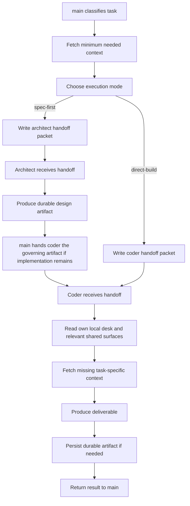

# Main To Specialist Handoff

## Trigger

- Source: `main` decides a task belongs with `architect` or `coder`
- Session type: sender is `agent:main:main`; receiver is the specialist standing main session

## Guaranteed Starting Context

- `main` has its own prompt context plus any local/shared context it explicitly fetched
- receiving specialist starts with its own system prompt, not with `main`'s working context
- the specialist sees the handoff message content, not the private reasoning `main` used to produce it

## Context That Must Be Fetched Explicitly

- by `main`: any local desk state, shared `/Desk/` state, Qdrant recall, and project artifacts needed to produce a good handoff
- by the specialist: any additional local workspace files, Nextcloud artifacts, repo context, or Qdrant recall needed after reading the handoff

## Flow

## Step Notes

1. `main` should not assume the specialist already knows local desk state, `/Desk/` state, or prior project docs.
2. `main` chooses the execution mode before sending specialist work when the task spans design and implementation.
3. In `spec-first`, coder receives the architect artifact as the governing artifact for implementation.
4. The handoff packet must include the facts the specialist would otherwise have to rediscover expensively.
5. The specialist still fetches its own supporting context after receiving the handoff.

## Escalation And Output

- specialist output returns to `agent:main:main`
- durable artifacts go to the specialist's normal destination, such as Nextcloud `/Projects/<slug>/...`, repo state, or Qdrant

## Prompt-Writing Pitfalls

- do not write specialist prompts as if they share `main`'s full context window
- do not refer to “the discussion above” unless the handoff actually contains the needed context
- do not make the handoff depend on unstated repo or Nextcloud state
