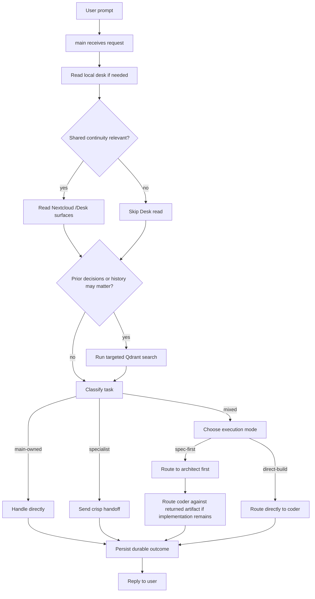

# Main User Request

## Trigger

- Source: direct user message to `main`
- Session type: `agent:main:main`

## Guaranteed Starting Context

- system prompt content from `AGENTS.md`, `TOOLS.md`, `SOUL.md`, `IDENTITY.md`, `USER.md`, and `MEMORY.md`
- bundled and workspace skill names plus descriptions
- available built-in tools, Nextcloud MCP tools, and Qdrant MCP tools
- local workspace files exist on disk, but their contents are not in prompt context until `main` reads them

## Context That Must Be Fetched Explicitly

- local `CURRENT.md`, `SURFACES.md`, and recent local daily note
- Nextcloud `/Desk/...` surfaces
- Qdrant recall
- specialist session state or handoff artifacts
- project artifacts in Nextcloud `/Projects/<slug>/`

## Flow

## Step Notes

1. `main` starts with only prompt-loaded identity/doctrine, not the contents of local desk files.
2. `main` reads local desk files only when the task is non-trivial or likely to be continuous work.
3. `main` reads Nextcloud `/Desk/...` only when shared continuity is relevant and only after deciding that the extra context is useful.
4. `main` uses small, cue-driven Qdrant searches rather than blind memory dumps.
5. `main` either handles the coordination itself or routes work to a standing specialist.
6. For mixed design plus implementation work, `main` chooses an execution mode before handing off specialist work.
7. In `spec-first`, `architect` produces the governing artifact before `coder` is asked to implement that scope.
8. `main` writes durable outcomes to the right surface before finishing.

## Escalation And Output

- user-facing answer goes back through the current channel route
- specialist work is sent through session routing, not described hypothetically
- no escalation to the user for discoverable repo/runtime facts

## Prompt-Writing Pitfalls

- do not assume `CURRENT.md` or `/Desk/current.md` contents are already known
- do not assume `main` knows project state without reading Nextcloud or Qdrant
- do not tell `main` to create project artifacts that belong with `architect`
