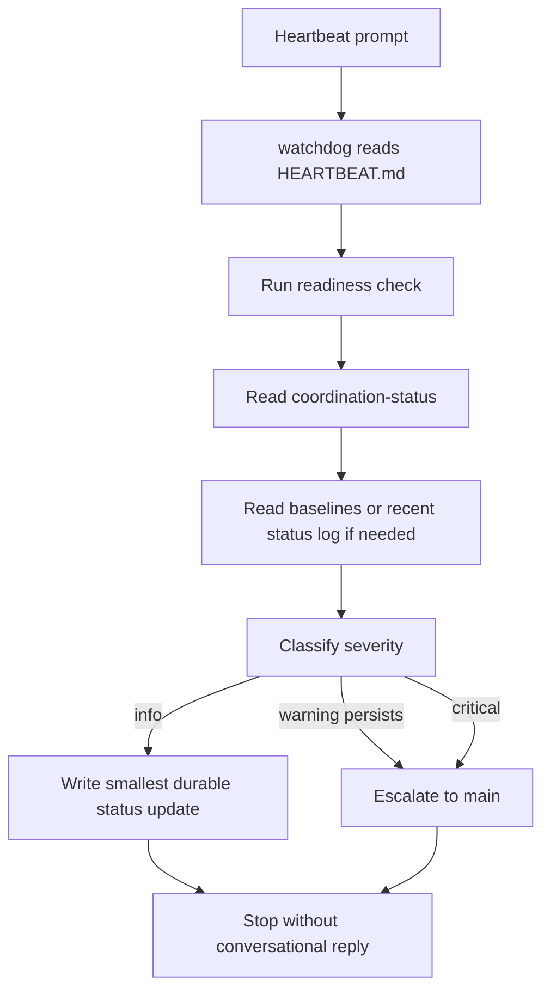

# Watchdog Heartbeat

## Trigger

- Source: automatic heartbeat prompt
- Session type: watchdog standing main session

## Guaranteed Starting Context

- system prompt content from `watchdog` workspace files except `HEARTBEAT.md`
- the heartbeat prompt itself tells watchdog to read `HEARTBEAT.md`
- tool list, including gateway-local tools, Nextcloud MCP, and Qdrant MCP
- watchdog is running on the gateway, not in a sandbox

## Context That Must Be Fetched Explicitly

- `HEARTBEAT.md`
- local `CURRENT.md` and `SURFACES.md` only if needed
- Nextcloud monitoring files
- current readiness signal
- budget status via `tokscale`

## Flow

## Step Notes

1. This is background maintenance inside watchdog's standing session, not a user conversation.
2. Watchdog should perform the narrow check, write the smallest durable state needed, and stop.
3. Local desk files are optional context, not guaranteed preloaded state.
4. Escalation is only for warning/critical conditions that meet the gate.

## Escalation And Output

- write durable monitoring state to Nextcloud when needed
- send an escalation to `agent:main:main` only when the severity gate is met
- do not spend the turn writing a conversational reply that nobody will read directly

## Prompt-Writing Pitfalls

- do not frame the heartbeat like a chat turn with a human reader
- do not tell watchdog to improvise maintenance outside the monitoring scope
- do not assume the recent status log has already been read
