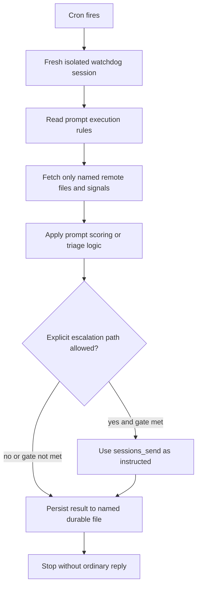

# Watchdog Isolated Cron

## Trigger

- Source: cron job such as nightly activity check or platform sweep
- Session type: isolated cron session

## Guaranteed Starting Context

- only the cron prompt plus the system-prompt files loaded for that cron mode
- no durable conversation history from the standing watchdog session
- no human will read a normal reply in this session

## Context That Must Be Fetched Explicitly

- any local workspace files the prompt tells watchdog to read
- any Nextcloud remote files named in the cron prompt
- any session-log summaries or runtime checks named in the cron prompt

## Flow

## Step Notes

1. Isolated cron context is a fresh session, so watchdog cannot rely on standing-session memory.
2. The cron prompt is the operational contract for that run.
3. If the prompt does not explicitly allow `sessions_send`, watchdog should not use it.
4. Durable output belongs in the named Nextcloud files or logs, not in a chat reply.

## Escalation And Output

- only use the escalation path explicitly permitted in the cron prompt
- otherwise write the requested durable state and stop

## Prompt-Writing Pitfalls

- do not speak as if a user is waiting for a reply in that session
- do not assume session visibility or cross-session state unless the prompt says so
- do not reference skills or files that do not exist in watchdog's actual runtime
