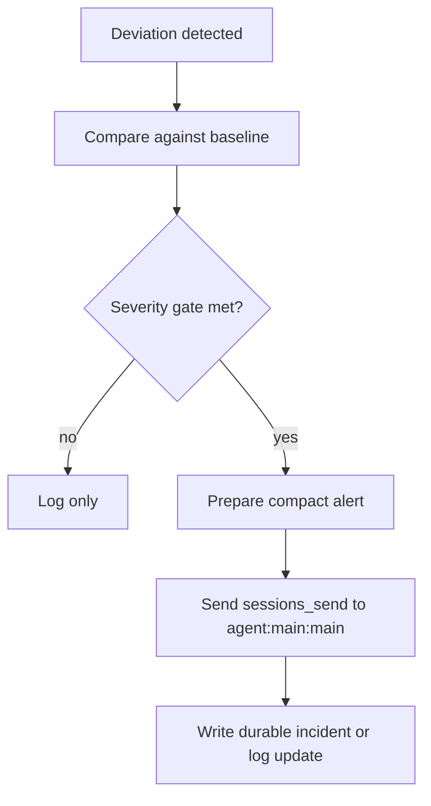

# Watchdog To Main Escalation

## Trigger

- Source: watchdog detects a warning that persisted or a confirmed critical condition
- Session type: either standing watchdog session or an isolated cron session that explicitly allows escalation

## Guaranteed Starting Context

- watchdog's monitoring doctrine and severity rules
- current check results gathered during the active run

## Context That Must Be Fetched Explicitly

- the latest baseline or status-log evidence needed to justify the escalation
- any supporting runtime checks used as the independent signal

## Flow

## Step Notes

1. Watchdog should escalate only after it has enough evidence to satisfy its own severity rules.
2. The escalation payload should be short, factual, and actionable.
3. The durable log or incident note remains the source of continuity after the alert is sent.

## Escalation And Output

- `sessions_send` target: `agent:main:main`
- payload: compact observation, baseline comparison, recommended owner/action
- durable follow-up: status log or incident note in Nextcloud

## Prompt-Writing Pitfalls

- do not escalate from watchdog just because something is interesting
- do not assume `main` has already seen the status log
- do not bury the actual signal in long prose
