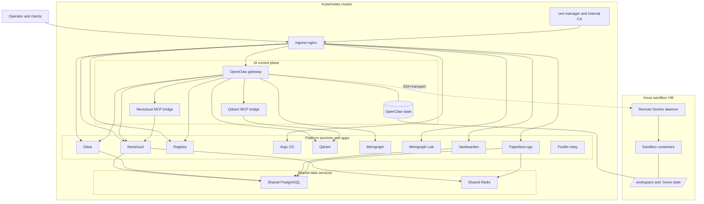

# Architecture

This page describes the steady-state deployed system: the cluster, the companion sandbox VM, and the services that make up the platform.

## Platform Topology

## Main Components

The deployed system has four big pieces:

1. `OpenClaw` as the user-facing AI gateway and coordinator inside Kubernetes
2. shared cluster services such as ingress, internal PKI, PostgreSQL, and Redis
3. platform apps and data services such as Nextcloud, Gitea, Argo CD, Qdrant, Memgraph, Vaultwarden, and Paperless-ngx
4. one companion Incus VM that hosts the remote Docker daemon used for sandbox containers

## Supported Targets

The repository intentionally supports only:

- `k3d` for local validation
- `k3s` for the real homelab deployment

The important constraint is that both targets converge on the same deployed component set and service contracts. `k3d` exists to exercise the local form of that platform before the `k3s` homelab deployment.

## OpenClaw as the Center

OpenClaw is the main entrypoint and the main reason the stack exists. It runs in Kubernetes, keeps durable state in the shared OpenClaw state tree, and reaches the remote Docker daemon in the companion VM over SSH.

The gateway is wired to the rest of the deployed platform:

- Nextcloud for shared project files and user content
- Gitea for repos and GitOps source
- Registry for sandbox and application images
- Qdrant and Memgraph for durable memory surfaces
- Argo CD as the in-cluster GitOps controller

The supporting services are not random add-ons. They exist to make the homelab useful around the AI plane:

- Nextcloud for user content
- Gitea for source control
- Vaultwarden for password management
- Paperless-ngx for documents

## Boundary Notes

- The cluster contains the long-lived control plane, data services, and user-facing apps.
- The Incus VM exists beside the cluster, not inside it, and is dedicated to remote Docker sandbox execution.
- Sandbox containers do not rely on Kubernetes DNS names; they reach ingress-exposed services through the hostnames the platform publishes.
- Argo CD is part of the deployed platform shape, but this page does not describe bootstrap or rollout procedure.

## See Also

- Platform runtime details: [openclaw-runtime.md](./openclaw-runtime.md)
- Security boundaries: [security.md](./security.md)
- Networking model: [networking.md](./networking.md)
- Service contracts: [services.md](./services.md)
